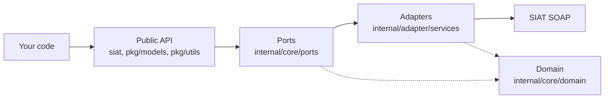

# Architecture

<p align="right">
  <a href="../../es/explanation/arquitectura.md">🇪🇸 Español</a> · <a href="../README.md">Docs index</a>
</p>

Why the SDK is shaped the way it is. This page is for understanding the design; it is not a how-to and not a full API listing.

---

## The problem being solved

SIAT is a SOAP API with twelve endpoints, dozens of operations, and a separate XSD schema for each of 51 document sectors. A direct translation into Go would leak all of that: hand-built envelopes, stringly-typed payloads, and a public surface that breaks whenever SIAT revises a schema.

The SDK's central goal is that **your code should never see a SOAP envelope**. Everything below the facade — namespaces, envelope construction, credential injection, response unwrapping — is an implementation detail you can neither depend on nor break.

That goal drives every decision below.

---

## Hexagonal architecture

The codebase is organised as ports and adapters.



| Layer | Location | Role |
| :--- | :--- | :--- |
| Public API | `siat.go`, `config.go`, `errors.go`, `code.go`, `middleware.go`, `http_config.go` | Everything you import |
| Public models | `pkg/models`, `pkg/models/invoices` | Request builders and invoice documents |
| Public utilities | `pkg/utils` | CUF, signing, compression, export |
| Ports | `internal/core/ports` | Interfaces the services must satisfy |
| Adapters | `internal/adapter/services` | SOAP/HTTP implementations |
| Domain | `internal/core/domain` | XML-tagged structs, generic envelope |
| Errors | `internal/core/errors` | `SiatError` and its classifiers |

The `internal/` prefix is enforced by the Go compiler: nothing under it can be imported from outside the module. That is not a convention, it is a boundary — which is what makes the SDK free to restructure its internals without a breaking release.

The one deliberate exception is `internal/core/ports`, which you touch for `WithDynamicConfig`. It is reachable only because the root package re-exports the pieces you need.

---

## The three decisions that shape the public API

### 1. Identity is configured once

`siat.Config` holds your `Token`, `Nit`, `CodigoSistema`, `CodigoAmbiente` and `BaseURL`. You pass it to `siat.New` and never again. Service methods take only `(ctx, req)`.

```go
s, _ := siat.New(cfg)
resp, err := s.Codigos().SolicitudCuis(ctx, req)
```

SIAT wants those identity fields inside almost every request body. Rather than making you set them on every builder, the adapter walks the request struct with reflection just before sending and fills in `Nit`, `CodigoSistema` and `CodigoAmbiente` **wherever the field is still zero**.

That "still zero" clause is the important part: injection is a default, not an override. Setting `WithNit` explicitly on a builder wins. Multi-tenant callers exploit the same seam through `WithDynamicConfig`, which merges a per-call config off the context before injection runs.

In v1 the signature was `(ctx, cfg, req)` — config travelled with every call. Moving it into the client removed a parameter from roughly sixty methods and made the identity a single source of truth.

### 2. Requests are opaque

`models.NewCuisBuilder().Build()` returns a `models.Cuis`. That type wraps a pointer to an internal struct and exposes nothing.

```
You build:   models.Cuis                    (opaque wrapper)
SDK unwraps: models.UnwrapInternalRequest[T] (recovers the internal struct)
SDK sends:   soap.Envelope[T]               (XML)
```

You cannot construct a request by struct literal, and you cannot read its fields. That is the point: the internal struct carries XML tags, namespace prefixes and SIAT's exact field ordering, all of which change when SIAT revises a schema. Because no user code can name those types, such a revision is a patch release rather than a major one.

The cost is that builders are the only way in. The benefit is that a builder can validate, apply defaults, and — for the packaging methods — perform real work.

### 3. Packaging methods return errors, not builders

Most setters are fluent. Four are not:

```go
func (b *RecepcionFacturaBuilder) WithFactura(factura any, signer XMLSigner) error
```

`WithFactura` marshals the document, signs it if the modality requires it, gzips, base64-encodes and hashes — four operations that can genuinely fail. A fluent setter would have to swallow those errors or panic. Returning `error` breaks the chain, which is exactly what the type system should force here.

This also explains the ordering rule that trips people up. `WithFactura` reads the modality **off the request being built** to decide whether to sign. Call it before `WithCodigoModalidad` and it sees zero, concludes no signature is needed, and produces an unsigned document with no local error — rejected later by SIAT with code 921.

The alternative would be deferring all the work to `Build()`, which would then need to return `(request, error)` and complicate every single call site for the sake of four methods. The current design puts the sharp edge where it is visible.

---

## How interfaces are organised

SIAT's twelve endpoints expose largely overlapping operations. The ports layer models that with embedding rather than repetition:

```go
type FacturacionService interface {
    RecepcionFactura(...)
    RecepcionPaqueteFactura(...)
    RecepcionMasivaFactura(...)
    ValidacionRecepcionPaqueteFactura(...)
    ValidacionRecepcionMasivaFactura(...)
    AnulacionFactura(...)
    ReversionAnulacionFactura(...)
    VerificacionEstadoFactura(...)
    VerificarComunicacion(...)
}

type SiatCompraVentaService interface {
    FacturacionService
    RecepcionAnexos(...)
}

type SiatSuministroEnergiaService interface {
    FacturacionService
    RecepcionAnexosSuministroEnergia(...)
}
```

`Electronica()` and `Computarizada()` both return `SiatSuministroEnergiaService`. Two facades, one interface, one endpoint each — so switching modality is a one-word change at the call site rather than a rewrite.

Note what the facade did **not** do: it kept a method per sector service rather than collapsing everything into one `Facturacion()` accessor. The interfaces unified; the entry points did not. Sector routing is a SIAT rule, and making it visible in the method name is more useful than hiding it behind a parameter.

---

## Generics carry the SOAP layer

One function performs every request in the SDK:

```go
func performSoapRequest[TReq any, TResp any](
    ctx context.Context,
    httpClient *http.Client,
    url string,
    config ports.Config,
    opaqueReq any,
) (*soap.EnvelopeResponse[TResp], error)
```

It merges any dynamic config from the context, unwraps the opaque request, injects credentials, builds the envelope, sets headers, sends, and decodes the response. Every one of the roughly sixty service methods is a thin call into it with two type parameters.

The payoff is on the response side. `soap.EnvelopeResponse[T]` means the compiler knows the exact payload type:

```go
resp, err := s.Codigos().SolicitudCuis(ctx, req)
// resp is *soap.EnvelopeResponse[codigos.CuisResponse]
resp.Body.Content.RespuestaCuis.Codigo
```

No type assertions, no map lookups, and a typo in the navigation path is a compile error rather than a runtime nil.

---

## Two-stage error handling

The design that surprises people most: a `nil` error does not mean success.

```go
resp, err := s.Electronica().RecepcionFactura(ctx, req)
if err != nil { /* transport */ }
if err := siat.Verify(resp.Body.Content.RespuestaServicioFacturacion); err != nil { /* rejection */ }
```

This mirrors reality rather than hiding it. SIAT answers a rejected invoice with HTTP 200 and a well-formed SOAP body containing `Transaccion: false` and a message list. Those are genuinely different failures: one means "try again", the other means "your data is wrong". Collapsing them into a single error would erase that distinction at exactly the moment you need it.

`siat.Verify` is deliberately separate rather than automatic, because a response can carry warnings that are not failures. It errors when `Transaccion` is false or any message is not a warning code — so accepted-with-warnings passes through cleanly, and the warnings stay available on the response.

Both paths produce `*siat.SiatError`, so one type and one `errors.As` handle everything downstream.

---

## Where extension points live

The SDK is closed for modification and open where it matters:

| You want to | Mechanism |
| :--- | :--- |
| Change timeouts, pooling, TLS | `HTTPConfig` → `NewHTTPClient` |
| Intercept every request | `HTTPMiddleware` on the `RoundTripper` chain |
| Serve many taxpayers | `WithDynamicConfig` on the context |
| Supply credentials from a vault | `NewP12Credential` / `NewPEMCredential` accept `[]byte` |
| Sign outside the send flow | `Config` implements `XMLSigner` |

Middleware sits at the transport layer, so it sees HTTP and nothing else. That is a real limit worth knowing: a retry middleware cannot see a SIAT-level rejection, because that rejection is an HTTP 200. Transport retries belong in middleware; rejection handling belongs in your code, after `Verify`.

---

## Concurrency

`*SiatServices` is safe for concurrent use. It holds configuration and an `*http.Client`, both of which are read-only after construction, and the client is itself concurrency-safe with connection pooling.

Per-tenant state lives on the context rather than the client, which is what lets one instance serve many taxpayers without locking. Builders are not shared and not safe to reuse across goroutines — build one per request, which is the natural usage anyway.

---

## Related

| | |
| :--- | :--- |
| Sector routing and document schemas | [Explanation: Sectors](sectors.md) |
| Type signatures for everything above | [Reference: API](../reference/api.md) |
| Tuning the HTTP layer | [Reference: Configuration](../reference/configuration.md) |
| Seeing the design in use | [Tutorial](../tutorial/first-invoice.md) |
