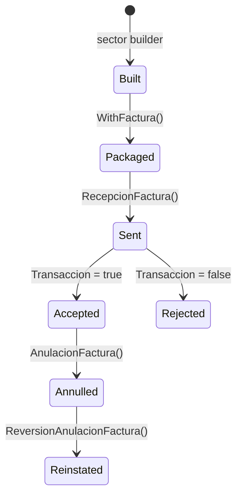

# How to send, annul and adjust invoices

<p align="right">
  <a href="../../es/how-to/envio-facturas.md">🇪🇸 Español</a> · <a href="../README.md">Docs index</a>
</p>

This guide covers the operations you perform on a single invoice after you know how to build one: sending it, annulling it, reversing that annulment, and issuing credit/debit notes against it.

> New to the SDK? Work through the [tutorial](../tutorial/first-invoice.md) first — it builds a complete invoice from scratch. For batching see [send batches](send-batches.md), for certificates see [sign invoices](sign-invoices.md), and for picking a sector see [sectors](../explanation/sectors.md).

---

## The lifecycle



Building and packaging happen entirely on your machine. Only the send step touches the network, so everything before it fails fast and locally.

---

## Send a single invoice

`WithFactura` collapses the whole packaging pipeline — serialize, sign if required, gzip, base64, hash — into one call:

```go
builder := models.NewRecepcionFacturaBuilder().
    WithCodigoModalidad(siat.ModalidadElectronica).   // ← must precede WithFactura
    WithCodigoSucursal(0).
    WithCodigoPuntoVenta(0).
    WithCodigoDocumentoSector(1).
    WithCodigoEmision(siat.EmisionOnline).
    WithTipoFacturaDocumento(1).
    WithCuis(cuis).
    WithCufd(cufd).
    WithFechaEnvio(time.Now())

if err := builder.WithFactura(factura, s.Config()); err != nil {
    log.Fatal("could not package the invoice:", err)
}

resp, err := s.Electronica().RecepcionFactura(ctx, builder.Build())
if err != nil {
    log.Fatal("transport failure:", err)
}
if err := siat.Verify(resp.Body.Content.RespuestaServicioFacturacion); err != nil {
    log.Fatal("SIAT rejected the invoice:", err)
}
```

`WithCodigoModalidad` must come before `WithFactura`, or the invoice goes out unsigned. That is the single most common cause of an unexplained signature rejection.

You never pass `Nit`, `CodigoSistema` or `CodigoAmbiente` — the SDK injects them from your `Config` on every request. The builders do expose `WithNit`, `WithCodigoSistema` and `WithCodigoAmbiente`, but only as an override: a value you set explicitly wins, a zero value gets filled in.

### Choosing the facade

`Electronica()` and `Computarizada()` expose the same nine methods, so switching modality is one word:

```go
s.Computarizada().RecepcionFactura(ctx, builder.Build())   // no signature needed
```

Sectors with a dedicated endpoint (`CompraVenta()`, `Telecomunicaciones()`, `ServicioBasico()`, `EntidadFinanciera()`, `BoletoAereo()`) must use theirs. See the [sector routing table](../explanation/sectors.md#how-a-sector-picks-its-service-endpoint).

### Packaging by hand

When you need the intermediate bytes — to archive the signed XML, or to send from an offline machine later — do the steps yourself:

```go
xmlBytes, _ := xml.Marshal(factura)
signed, _ := s.Config().SignXML(xmlBytes)
hash, encoded, _ := utils.CompressAndHash(signed)

builder.WithArchivo(encoded).WithHashArchivo(hash)
```

Use `WithFactura` **or** the `WithArchivo`/`WithHashArchivo` pair, never both — the last call wins.

---

## Check whether an invoice landed

`Transaccion` is the field that tells you whether SIAT took the document. `siat.Verify` already reads it, but you often want the reception code as well:

```go
r := resp.Body.Content.RespuestaServicioFacturacion
r.Transaccion        // bool — accepted?
r.CodigoRecepcion    // string — SIAT's handle for this submission
r.CodigoEstado       // int — state code
r.MensajesList       // []Mensaje — reason, when rejected
```

To query an invoice you sent earlier:

```go
req := models.NewVerificacionEstadoFacturaBuilder().
    WithCuf(cuf).
    WithCodigoModalidad(siat.ModalidadElectronica).
    WithCodigoSucursal(0).
    WithCodigoPuntoVenta(0).
    WithCodigoDocumentoSector(1).
    WithCodigoEmision(siat.EmisionOnline).
    WithTipoFacturaDocumento(1).
    WithCuis(cuis).
    WithCufd(cufd).
    Build()

resp, err := s.Electronica().VerificacionEstadoFactura(ctx, req)
```

---

## Annul an invoice

Annulment identifies the invoice by its CUF and requires a reason code:

```go
req := models.NewAnulacionFacturaBuilder().
    WithCuf(cufOfTheInvoice).
    WithCodigoMotivo(1).
    WithCodigoModalidad(siat.ModalidadElectronica).
    WithCodigoSucursal(0).
    WithCodigoPuntoVenta(0).
    WithCodigoDocumentoSector(1).
    WithCodigoEmision(siat.EmisionOnline).
    WithTipoFacturaDocumento(1).
    WithCuis(cuis).
    WithCufd(cufd).
    Build()

resp, err := s.Electronica().AnulacionFactura(ctx, req)
if err != nil {
    log.Fatal(err)
}
if err := siat.Verify(resp.Body.Content.RespuestaServicioFacturacion); err != nil {
    log.Fatal("annulment refused:", err)
}
```

Valid `CodigoMotivo` values are a SIAT parametric, not an SDK constant. Fetch the current list rather than hardcoding:

```go
resp, _ := s.Sincronizacion().SincronizarParametricaMotivoAnulacion(ctx, req)
```

### Reverse an annulment

Same shape, different builder — no reason code, because you are undoing one:

```go
req := models.NewReversionAnulacionFacturaBuilder().
    WithCuf(cufOfTheInvoice).
    WithCodigoModalidad(siat.ModalidadElectronica).
    // ... same identifying fields as above
    Build()

resp, err := s.Electronica().ReversionAnulacionFactura(ctx, req)
```

Reversal is not an unlimited undo — SIAT constrains how and when an annulment can be rolled back, and a refused reversal comes back as a rejection message rather than a transport error. Read `MensajesList` before retrying.

---

## Issue a credit/debit note

Adjustment documents are not invoices. They are built like invoices, but they go to `DocumentoAjuste()`, and its methods carry `*DocumentoAjuste` names rather than `*Factura` ones.

```go
nota := invoices.NewNotaCreditoDebitoBuilder().
    WithModalidad(siat.ModalidadElectronica).
    WithCabecera(cabecera).
    AddDetalle(detalle).
    Build()

builder := models.NewRecepcionDocumentoAjusteBuilder().
    WithCodigoModalidad(siat.ModalidadElectronica).
    WithCodigoDocumentoSector(24).
    WithCodigoEmision(siat.EmisionOnline).
    WithTipoFacturaDocumento(3).      // ← 3, not 1
    WithCodigoSucursal(0).
    WithCodigoPuntoVenta(0).
    WithCuis(cuis).
    WithCufd(cufd).
    WithFechaEnvio(time.Now())

if err := builder.WithDocumento(nota, s.Config()); err != nil {
    log.Fatal(err)
}

resp, err := s.DocumentoAjuste().RecepcionDocumentoAjuste(ctx, builder.Build())
```

Two things differ from a normal invoice and both are easy to miss:

- `WithTipoFacturaDocumento(3)` — adjustment documents are document type 3.
- The packaging method is `WithDocumento`, not `WithFactura`. Same signature, same rules, same `WithCodigoModalidad`-first requirement.

**The response field is named differently too.** `RecepcionDocumentoAjusteResponse` exposes the result as `RespuestaRecepcionFactura`, even though the underlying XML element is the same `RespuestaServicioFacturacion`:

```go
siat.Verify(resp.Body.Content.RespuestaRecepcionFactura)
```

The other adjustment operations — `AnulacionDocumentoAjuste`, `ReversionAnulacionDocumentoAjuste`, `VerificacionEstadoDocumentoAjuste` — use `RespuestaServicioFacturacion` as usual.

### Which note builder to use

| Document | Builder | Sector |
| :--- | :--- | ---: |
| Credit/debit note | `invoices.NewNotaCreditoDebitoBuilder()` | 24 |
| Fiscal credit/debit note | `invoices.NewNotaFiscalCreditoDebitoBuilder()` | 24 |
| Conciliation note | `invoices.NewNotaConciliacionBuilder()` | 29 |
| Credit/debit with discount | `invoices.NewNotaCreditoDebitoDescuentoBuilder()` | 47 |
| ICE credit/debit note | `invoices.NewNotaCreditoDebitoIceBuilder()` | 48 |

---

## Related

| | |
| :--- | :--- |
| Complete worked example | [Tutorial](../tutorial/first-invoice.md) |
| Many invoices in one request | [How-to: Send batches](send-batches.md) |
| Certificates and signing | [How-to: Sign invoices](sign-invoices.md) |
| What a rejection code means | [How-to: Handle errors](handle-errors.md) |
| Picking the right sector and facade | [Explanation: Sectors](../explanation/sectors.md) |
