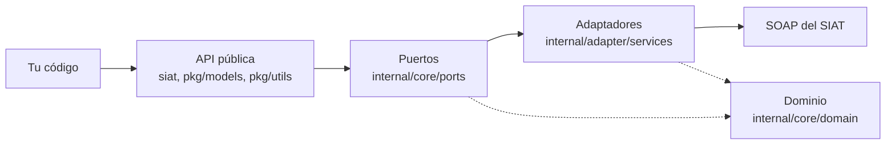

# Arquitectura

<p align="right">
  <a href="../../en/explanation/architecture.md">🇬🇧 English</a> · <a href="../README.md">Índice de documentación</a>
</p>

Por qué el SDK tiene la forma que tiene. Esta página es para entender el diseño; no es una guía práctica ni un listado completo de la API.

---

## El problema que se resuelve

El SIAT es una API SOAP con doce endpoints, decenas de operaciones y un esquema XSD separado para cada uno de los 51 documentos sector. Una traducción directa a Go filtraría todo eso: sobres armados a mano, payloads con strings sueltos y una superficie pública que se rompe cada vez que el SIAT revisa un esquema.

El objetivo central del SDK es que **tu código nunca vea un sobre SOAP**. Todo lo que está debajo de la fachada — namespaces, construcción del sobre, inyección de credenciales, desempaquetado de respuestas — es un detalle de implementación del que no podés depender ni podés romper.

Ese objetivo explica cada decisión de abajo.

---

## Arquitectura hexagonal

El código está organizado como puertos y adaptadores.



| Capa | Ubicación | Rol |
| :--- | :--- | :--- |
| API pública | `siat.go`, `config.go`, `errors.go`, `code.go`, `middleware.go`, `http_config.go` | Todo lo que importás |
| Modelos públicos | `pkg/models`, `pkg/models/invoices` | Builders de solicitud y documentos de factura |
| Utilidades públicas | `pkg/utils` | CUF, firma, compresión, exportación |
| Puertos | `internal/core/ports` | Interfaces que los servicios deben cumplir |
| Adaptadores | `internal/adapter/services` | Implementaciones SOAP/HTTP |
| Dominio | `internal/core/domain` | Structs con tags XML, sobre genérico |
| Errores | `internal/core/errors` | `SiatError` y sus clasificadores |

El prefijo `internal/` lo hace cumplir el compilador de Go: nada de lo que está debajo puede importarse desde fuera del módulo. Eso no es una convención, es una frontera — y es lo que le da al SDK libertad de reestructurar sus internos sin un release que rompa.

La única excepción deliberada es `internal/core/ports`, que tocás para `WithDynamicConfig`. Es alcanzable solo porque el paquete raíz re-exporta las piezas que necesitás.

---

## Las tres decisiones que le dan forma a la API pública

### 1. La identidad se configura una sola vez

`siat.Config` guarda tu `Token`, `Nit`, `CodigoSistema`, `CodigoAmbiente` y `BaseURL`. Se lo pasás a `siat.New` y nunca más. Los métodos de servicio reciben solo `(ctx, req)`.

```go
s, _ := siat.New(cfg)
resp, err := s.Codigos().SolicitudCuis(ctx, req)
```

El SIAT quiere esos campos de identidad dentro de casi todas las solicitudes. En vez de obligarte a ponerlos en cada builder, el adaptador recorre el struct de la solicitud con reflexión justo antes de enviar y completa `Nit`, `CodigoSistema` y `CodigoAmbiente` **donde el campo sigue en cero**.

Esa cláusula "sigue en cero" es lo importante: la inyección es un default, no un override. Poner `WithNit` de forma explícita en un builder gana. Los casos multi-inquilino aprovechan la misma costura con `WithDynamicConfig`, que fusiona una configuración por llamada tomada del contexto antes de que corra la inyección.

En v1 la firma era `(ctx, cfg, req)` — la configuración viajaba con cada llamada. Moverla al cliente sacó un parámetro de unos ochenta métodos y convirtió la identidad en una única fuente de verdad.

### 2. Las solicitudes son opacas

`models.NewCuisBuilder().Build()` devuelve un `models.Cuis`. Ese tipo envuelve un puntero a un struct interno y no expone nada.

```
Vos armás:          models.Cuis                     (envoltorio opaco)
El SDK desenvuelve: models.UnwrapInternalRequest[T]  (recupera el struct interno)
El SDK envía:       soap.Envelope[T]                (XML)
```

No podés construir una solicitud con un literal de struct, y no podés leer sus campos. Ese es justamente el punto: el struct interno lleva tags XML, prefijos de namespace y el orden exacto de campos que exige el SIAT, y todo eso cambia cuando el SIAT revisa un esquema. Como ningún código de usuario puede nombrar esos tipos, semejante revisión es un release de parche y no uno mayor.

El costo es que los builders son la única puerta de entrada. El beneficio es que un builder puede validar, aplicar defaults y — en los métodos de empaquetado — hacer trabajo real.

### 3. Los métodos de empaquetado devuelven error, no el builder

La mayoría de los setters son fluidos. Cuatro no lo son:

```go
func (b *RecepcionFacturaBuilder) WithFactura(factura any, signer XMLSigner) error
```

`WithFactura` serializa el documento, lo firma si la modalidad lo exige, hace gzip, codifica en base64 y hashea — cuatro operaciones que pueden fallar de verdad. Un setter fluido tendría que tragarse esos errores o entrar en pánico. Devolver `error` rompe la cadena, que es exactamente lo que el sistema de tipos debería forzar acá.

Esto también explica la regla de orden con la que todo el mundo tropieza. `WithFactura` lee la modalidad **de la solicitud que se está construyendo** para decidir si firma. Si lo llamás antes que `WithCodigoModalidad`, ve un cero, concluye que no hace falta firma y produce un documento sin firmar sin ningún error local — rechazado después por el SIAT con el código 921.

La alternativa sería postergar todo el trabajo a `Build()`, que entonces tendría que devolver `(solicitud, error)` y complicar absolutamente todos los puntos de llamada por culpa de cuatro métodos. El diseño actual pone el filo donde se ve.

---

## Cómo se organizan las interfaces

Los doce endpoints del SIAT exponen operaciones que se superponen en gran medida. La capa de puertos modela eso con embebido en vez de repetición:

```go
type FacturacionService interface {
    RecepcionFactura(...)
    RecepcionPaqueteFactura(...)
    RecepcionMasivaFactura(...)
    ValidacionRecepcionPaqueteFactura(...)
    ValidacionRecepcionMasivaFactura(...)
    AnulacionFactura(...)
    ReversionAnulacionFactura(...)
    VerificacionEstadoFactura(...)
    VerificarComunicacion(...)
}

type SiatCompraVentaService interface {
    FacturacionService
    RecepcionAnexos(...)
}

type SiatSuministroEnergiaService interface {
    FacturacionService
    RecepcionAnexosSuministroEnergia(...)
}
```

`Electronica()` y `Computarizada()` devuelven las dos `SiatSuministroEnergiaService`. Dos fachadas, una interfaz, un endpoint cada una — así que cambiar de modalidad es cambiar una palabra en el punto de llamada y no reescribir nada.

Notá lo que la fachada **no** hizo: mantuvo un método por servicio de sector en vez de colapsar todo en un único accesor `Facturacion()`. Las interfaces se unificaron; los puntos de entrada no. El enrutamiento por sector es una regla del SIAT, y dejarla visible en el nombre del método es más útil que esconderla detrás de un parámetro.

---

## Los genéricos sostienen la capa SOAP

Una sola función ejecuta todas las solicitudes del SDK:

```go
func performSoapRequest[TReq any, TResp any](
    ctx context.Context,
    httpClient *http.Client,
    url string,
    config ports.Config,
    opaqueReq any,
) (*soap.EnvelopeResponse[TResp], error)
```

Fusiona la configuración dinámica del contexto si la hay, desenvuelve la solicitud opaca, inyecta credenciales, arma el sobre, pone las cabeceras, envía y decodifica la respuesta. Cada uno de los aproximadamente ochenta métodos de servicio es una llamada delgada a esta función con dos parámetros de tipo.

La recompensa está del lado de la respuesta. `soap.EnvelopeResponse[T]` significa que el compilador conoce el tipo exacto del payload:

```go
resp, err := s.Codigos().SolicitudCuis(ctx, req)
// resp es *soap.EnvelopeResponse[codigos.CuisResponse]
resp.Body.Content.RespuestaCuis.Codigo
```

Sin type assertions, sin búsquedas en mapas, y un error de tipeo en la ruta de navegación es un error de compilación y no un nil en tiempo de ejecución.

---

## Manejo de errores en dos etapas

El diseño que más sorprende: un error `nil` no significa éxito.

```go
resp, err := s.Electronica().RecepcionFactura(ctx, req)
if err != nil { /* transporte */ }
if err := siat.Verify(resp.Body.Content.RespuestaServicioFacturacion); err != nil { /* rechazo */ }
```

Esto refleja la realidad en vez de esconderla. El SIAT responde una factura rechazada con HTTP 200 y un cuerpo SOAP bien formado que contiene `Transaccion: false` y una lista de mensajes. Son fallas genuinamente distintas: una significa "reintentá", la otra significa "tus datos están mal". Colapsarlas en un solo error borraría esa distinción justo en el momento en que la necesitás.

`siat.Verify` está separado a propósito y no es automático, porque una respuesta puede traer advertencias que no son fallas. Da error cuando `Transaccion` es false o cuando algún mensaje no es un código de advertencia — así que aceptada-con-advertencias pasa limpio, y las advertencias quedan disponibles en la respuesta.

Los dos caminos producen `*siat.SiatError`, así que un solo tipo y un solo `errors.As` cubren todo lo que viene después.

---

## Dónde están los puntos de extensión

El SDK está cerrado a la modificación y abierto donde importa:

| Si querés | Mecanismo |
| :--- | :--- |
| Cambiar timeouts, pooling, TLS | `HTTPConfig` → `NewHTTPClient` |
| Interceptar todas las solicitudes | `HTTPMiddleware` en la cadena de `RoundTripper` |
| Atender a muchos contribuyentes | `WithDynamicConfig` en el contexto |
| Traer credenciales de un vault | `NewP12Credential` / `NewPEMCredential` aceptan `[]byte` |
| Firmar fuera del flujo de envío | `Config` implementa `XMLSigner` |

El middleware está en la capa de transporte, así que ve HTTP y nada más. Ese es un límite real que conviene conocer: un middleware de reintentos no puede ver un rechazo a nivel SIAT, porque ese rechazo es un HTTP 200. Los reintentos de transporte van en el middleware; el manejo de rechazos va en tu código, después de `Verify`.

---

## Concurrencia

`*SiatServices` es seguro para uso concurrente. Guarda configuración y un `*http.Client`, los dos de solo lectura después de la construcción, y el cliente es a su vez seguro para concurrencia con pooling de conexiones.

El estado por inquilino vive en el contexto y no en el cliente, y eso es lo que permite que una instancia atienda a muchos contribuyentes sin locks. Los builders no se comparten y no son seguros para reusar entre goroutines — armá uno por solicitud, que además es el uso natural.

---

## Relacionado

| | |
| :--- | :--- |
| Enrutamiento por sector y esquemas de documento | [Explicación: Sectores](sectores.md) |
| Firmas de tipos de todo lo de arriba | [Referencia: API](../reference/api.md) |
| Ajustar la capa HTTP | [Referencia: Configuración](../reference/configuracion.md) |
| Ver el diseño en acción | [Tutorial](../tutorial/primera-factura.md) |
