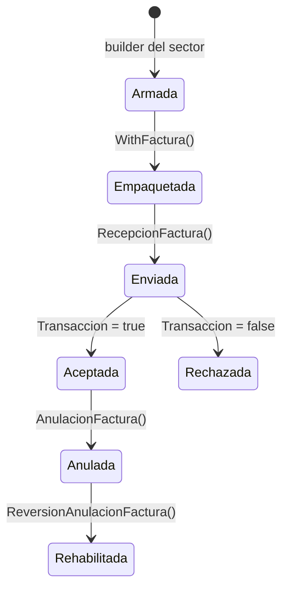

# Cómo enviar, anular y ajustar facturas

<p align="right">
  <a href="../../en/how-to/send-invoices.md">🇬🇧 English</a> · <a href="../README.md">Índice de documentación</a>
</p>

Esta guía cubre las operaciones que hacés sobre una factura individual una vez que sabés armarla: enviarla, anularla, revertir esa anulación y emitir notas de crédito/débito contra ella.

> ¿Recién empezás con el SDK? Hacé primero el [tutorial](../tutorial/primera-factura.md) — arma una factura completa desde cero. Para lotes mirá [envío por lotes](envio-lotes.md), para certificados [firmar facturas](firmar-facturas.md), y para elegir sector [sectores](../explanation/sectores.md).

---

## El ciclo de vida



Armar y empaquetar pasa enteramente en tu máquina. Solo el paso de envío toca la red, así que todo lo anterior falla rápido y de forma local.

---

## Enviar una factura individual

`WithFactura` concentra todo el proceso de empaquetado — serializar, firmar si corresponde, gzip, base64, hash — en una sola llamada:

```go
builder := models.NewRecepcionFacturaBuilder().
    WithCodigoModalidad(siat.ModalidadElectronica).   // ← tiene que ir antes de WithFactura
    WithCodigoSucursal(0).
    WithCodigoPuntoVenta(0).
    WithCodigoDocumentoSector(1).
    WithCodigoEmision(siat.EmisionOnline).
    WithTipoFacturaDocumento(1).
    WithCuis(cuis).
    WithCufd(cufd).
    WithFechaEnvio(time.Now())

if err := builder.WithFactura(factura, s.Config()); err != nil {
    log.Fatal("no se pudo empaquetar la factura:", err)
}

resp, err := s.Electronica().RecepcionFactura(ctx, builder.Build())
if err != nil {
    log.Fatal("falla de transporte:", err)
}
if err := siat.Verify(resp.Body.Content.RespuestaServicioFacturacion); err != nil {
    log.Fatal("el SIAT rechazó la factura:", err)
}
```

`WithCodigoModalidad` tiene que ir antes que `WithFactura`, si no la factura sale sin firmar. Es la causa más común de un rechazo por firma que no se explica de otra forma.

Nunca pasás `Nit`, `CodigoSistema` ni `CodigoAmbiente` — el SDK los inyecta desde tu `Config` en cada solicitud. Los builders sí exponen `WithNit`, `WithCodigoSistema` y `WithCodigoAmbiente`, pero solo como override: el valor que ponés explícito gana, y el valor cero se completa solo.

### Elegir la fachada

`Electronica()` y `Computarizada()` exponen los mismos nueve métodos, así que cambiar de modalidad es una palabra:

```go
s.Computarizada().RecepcionFactura(ctx, builder.Build())   // no necesita firma
```

Los sectores con endpoint propio (`CompraVenta()`, `Telecomunicaciones()`, `ServicioBasico()`, `EntidadFinanciera()`, `BoletoAereo()`) tienen que usar el suyo. Mirá la [tabla de enrutamiento por sector](../explanation/sectores.md#cómo-elige-un-sector-su-endpoint).

### Empaquetar a mano

Cuando necesitás los bytes intermedios — para archivar el XML firmado, o para enviar después desde una máquina offline — hacé los pasos vos mismo:

```go
xmlBytes, _ := xml.Marshal(factura)
firmado, _ := s.Config().SignXML(xmlBytes)
hash, encoded, _ := utils.CompressAndHash(firmado)

builder.WithArchivo(encoded).WithHashArchivo(hash)
```

Usá `WithFactura` **o** el par `WithArchivo`/`WithHashArchivo`, nunca los dos — gana el último que se llame.

---

## Verificar si la factura entró

`Transaccion` es el campo que te dice si el SIAT tomó el documento. `siat.Verify` ya lo lee, pero muchas veces querés también el código de recepción:

```go
r := resp.Body.Content.RespuestaServicioFacturacion
r.Transaccion        // bool — ¿aceptada?
r.CodigoRecepcion    // string — la manija del SIAT para este envío
r.CodigoEstado       // int — código de estado
r.MensajesList       // []Mensaje — el motivo, cuando hay rechazo
```

Para consultar una factura que enviaste antes:

```go
req := models.NewVerificacionEstadoFacturaBuilder().
    WithCuf(cuf).
    WithCodigoModalidad(siat.ModalidadElectronica).
    WithCodigoSucursal(0).
    WithCodigoPuntoVenta(0).
    WithCodigoDocumentoSector(1).
    WithCodigoEmision(siat.EmisionOnline).
    WithTipoFacturaDocumento(1).
    WithCuis(cuis).
    WithCufd(cufd).
    Build()

resp, err := s.Electronica().VerificacionEstadoFactura(ctx, req)
```

---

## Anular una factura

La anulación identifica la factura por su CUF y exige un código de motivo:

```go
req := models.NewAnulacionFacturaBuilder().
    WithCuf(cufDeLaFactura).
    WithCodigoMotivo(1).
    WithCodigoModalidad(siat.ModalidadElectronica).
    WithCodigoSucursal(0).
    WithCodigoPuntoVenta(0).
    WithCodigoDocumentoSector(1).
    WithCodigoEmision(siat.EmisionOnline).
    WithTipoFacturaDocumento(1).
    WithCuis(cuis).
    WithCufd(cufd).
    Build()

resp, err := s.Electronica().AnulacionFactura(ctx, req)
if err != nil {
    log.Fatal(err)
}
if err := siat.Verify(resp.Body.Content.RespuestaServicioFacturacion); err != nil {
    log.Fatal("anulación rechazada:", err)
}
```

Los valores válidos de `CodigoMotivo` son una paramétrica del SIAT, no una constante del SDK. Traé la lista vigente en vez de hardcodearla:

```go
resp, _ := s.Sincronizacion().SincronizarParametricaMotivoAnulacion(ctx, req)
```

### Revertir una anulación

Misma forma, otro builder — sin código de motivo, porque estás deshaciendo uno:

```go
req := models.NewReversionAnulacionFacturaBuilder().
    WithCuf(cufDeLaFactura).
    WithCodigoModalidad(siat.ModalidadElectronica).
    // ... mismos campos identificatorios de arriba
    Build()

resp, err := s.Electronica().ReversionAnulacionFactura(ctx, req)
```

La reversión no es un deshacer ilimitado — el SIAT pone condiciones sobre cómo y cuándo se puede revertir una anulación, y una reversión rechazada vuelve como mensaje de rechazo, no como error de transporte. Leé `MensajesList` antes de reintentar.

---

## Emitir una nota de crédito/débito

Los documentos de ajuste no son facturas. Se arman igual que una factura, pero van a `DocumentoAjuste()`, y sus métodos llevan nombres `*DocumentoAjuste` en vez de `*Factura`.

```go
nota := invoices.NewNotaCreditoDebitoBuilder().
    WithModalidad(siat.ModalidadElectronica).
    WithCabecera(cabecera).
    AddDetalle(detalle).
    Build()

builder := models.NewRecepcionDocumentoAjusteBuilder().
    WithCodigoModalidad(siat.ModalidadElectronica).
    WithCodigoDocumentoSector(24).
    WithCodigoEmision(siat.EmisionOnline).
    WithTipoFacturaDocumento(3).      // ← 3, no 1
    WithCodigoSucursal(0).
    WithCodigoPuntoVenta(0).
    WithCuis(cuis).
    WithCufd(cufd).
    WithFechaEnvio(time.Now())

if err := builder.WithDocumento(nota, s.Config()); err != nil {
    log.Fatal(err)
}

resp, err := s.DocumentoAjuste().RecepcionDocumentoAjuste(ctx, builder.Build())
```

Dos cosas cambian respecto de una factura normal y las dos son fáciles de pasar por alto:

- `WithTipoFacturaDocumento(3)` — los documentos de ajuste son tipo de documento 3.
- El método de empaquetado es `WithDocumento`, no `WithFactura`. Misma firma, mismas reglas, misma exigencia de `WithCodigoModalidad` primero.

**El campo de respuesta también se llama distinto.** `RecepcionDocumentoAjusteResponse` expone el resultado como `RespuestaRecepcionFactura`, aunque el elemento XML de fondo sea el mismo `RespuestaServicioFacturacion`:

```go
siat.Verify(resp.Body.Content.RespuestaRecepcionFactura)
```

Las demás operaciones de ajuste — `AnulacionDocumentoAjuste`, `ReversionAnulacionDocumentoAjuste`, `VerificacionEstadoDocumentoAjuste` — usan `RespuestaServicioFacturacion` como siempre.

### Qué builder de nota usar

| Documento | Builder | Sector |
| :--- | :--- | ---: |
| Nota de crédito/débito | `invoices.NewNotaCreditoDebitoBuilder()` | 24 |
| Nota fiscal de crédito/débito | `invoices.NewNotaFiscalCreditoDebitoBuilder()` | 24 |
| Nota de conciliación | `invoices.NewNotaConciliacionBuilder()` | 29 |
| Nota de crédito/débito con descuento | `invoices.NewNotaCreditoDebitoDescuentoBuilder()` | 47 |
| Nota de crédito/débito ICE | `invoices.NewNotaCreditoDebitoIceBuilder()` | 48 |

---

## Relacionado

| | |
| :--- | :--- |
| Ejemplo completo paso a paso | [Tutorial](../tutorial/primera-factura.md) |
| Muchas facturas en una sola petición | [Guía: Envío por lotes](envio-lotes.md) |
| Certificados y firma | [Guía: Firmar facturas](firmar-facturas.md) |
| Qué significa un código de rechazo | [Guía: Manejo de errores](manejo-errores.md) |
| Elegir el sector y la fachada correctos | [Explicación: Sectores](../explanation/sectores.md) |
